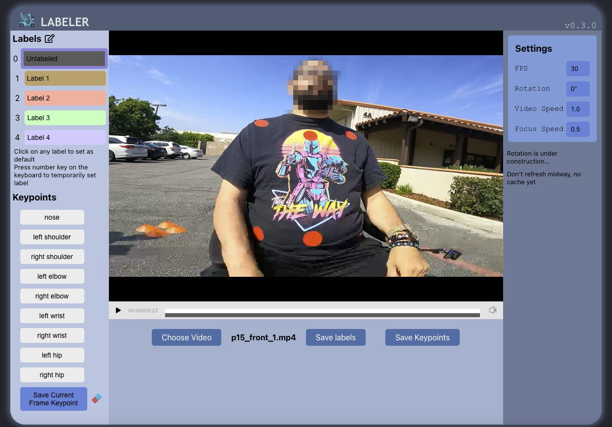
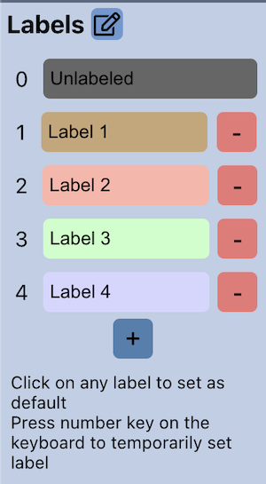
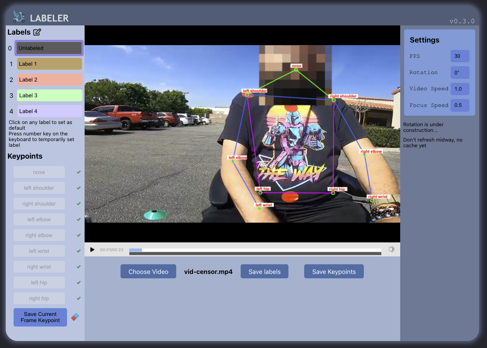
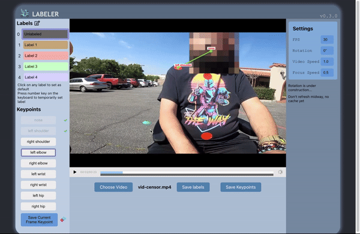
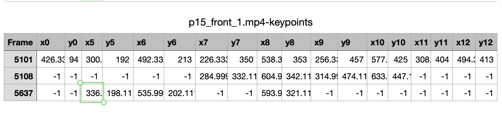

# Getting Started with Labeler App

Production: https://mobility-scooter-project.github.io/labeler/

## Setup For Local
This project was bootstrapped with [Create React App](https://github.com/facebook/create-react-app).
In the project directory, you can run:
1. Go to web directory:
### `cd /web`

2. Install required packages:
### `npm install`
3. Start project:
### `npm start`

Runs the app in the development mode.\
Open [http://localhost:3000](http://localhost:3000) to view it in your browser.

The page will reload when you make changes.\
You may also see any lint errors in the console.

## How to use

#### Step 1: Upload video for labeling
Upload a video for labeling by clicking the 'Choose Video' button and selecting the desired video

#### Step 2: Labeling frame

##### Edit label panel

Click on a pencil button next to title Labels to start editing label panel
###### Under editing label panel mode you can:
- Rename the label name in this panel and start labeling
- Add more label or remove default label

##### Labeling frame
1. Choose the current frame label on the left panel

2. Press start the video, the label would attach to the progress frame under the video controller
*You can skip through the video to speed up the labeling process if you believe the entire frame is correctly labeled.*

##### Save labels as CSV

After labeling all desired frames of the video, you can hit button "Save labels" at the bottom to save all the data as CSV file.

#### Step 3: Marking keypoint

##### Mark keypoints
- Pause a video and choose desired keypoint to mark
- Click on the video frame to mark keypoints
- Hit "Save Current Frame Keypoint" to save the current frame data
- Move on to another frame to continue marking keypoint

##### Delete keypoints
- Click on the eraser next to the 'Save Current Frame Keypoint' button, and then select the keypoint you want to delete on the screen

###### Note: Remember to "unclick" eraser if you want to mark new keypoint.

##### Save keypoints as CSV
- After marking all the frames, you can save all the data as CSV by clicking on the button "Save Keypoints" at the corner.

The CSV file would look like this:

##### *Explaination*

Frame column is the index of the current frame. The project uses the video recorded as 30fps. Based on the frame index you can convert to the current time based on this fomular:

$$ { index_{frame} \over fps_{video}} = time_{current} $$

*Example:*
$ {5101 \over 30}  = 170.0333 (second)$
170.0333 seconds $\approx$ 2 minutes 50 seconds

*__(x0,y0)__ is coordinate __(x,y)__ of __"nose"__ where the origin __(0,0)__ at the __top left__ corner of the video frame.*

Digit of (xn,yn) where n follows the following notation:

| n | point | 
|---|---|
| 0 | nose | 
| 5  | left shoulder  |
| 6  | right shoulder |
| 7  | left elbow  |
| 8  | right elbow  |
| 9  | left wrist  |
| 10  | lright wrist  |
| 11  | left hip  |
| 12  | right hip  |

